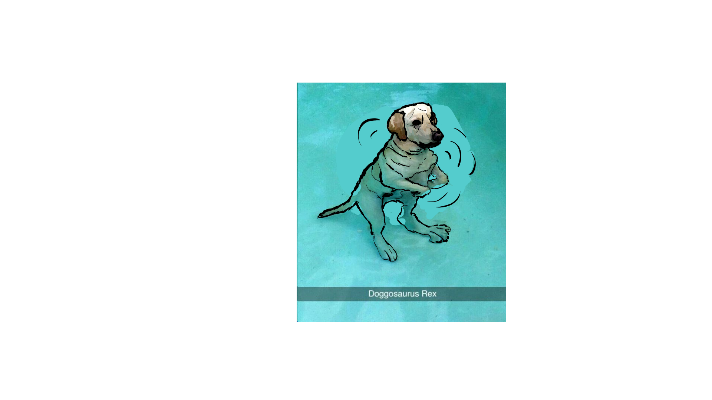
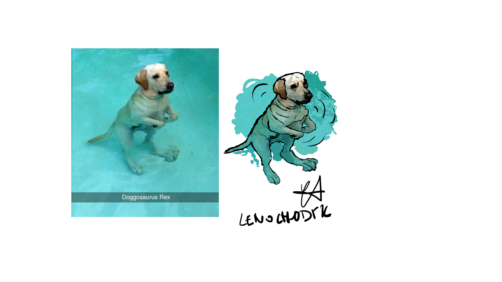

# Digital Painting - Doggosaurus Rex

This project was made in Corel Painter with usage of graphic tablet Wacom.

## Progress
I can see now that the changes might be hard to spot as I kept the template image underneath in the exports. However I've commented the changes in the sessions.

### First session

### Second session

### Third session

### Fourth session

### Fifth session

### Sixth, final session

